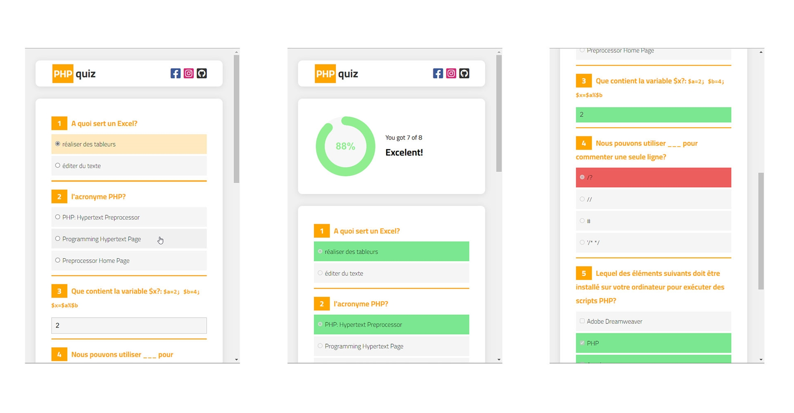

# LDPDWI quiz challenge
## Preview

## Description
A quiz is a game that consists of a questionnaire to test general knowledge
or specific or skills (source: wikipedia)
We want to create a web quiz system with a multiple choice questionnaire. For this, a
questionnaire is represented in a PHP table containing:
1. the questions (text),
2. the answer choices (a PHP array) in case the answer type is choice from a list,
3. the type of response: choice from a list (checkbox) or free text (text),
4. The correct answers (another PHP array containing the correct answers) or just one
response (text).
## Challenge
• create a PHP function allowing to generate the html form of the Quiz corresponding to a
generalized $quest array (so processing will assume we have n number of
questions in the table).
• perform the necessary PHP processing to receive a user's responses
on the questionnaire and count the number of correct answers.
• Any effort on the layout and presentation (CSS) of the web system will be welcome.
